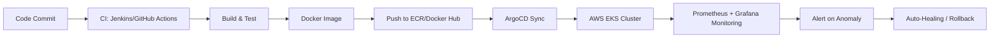

<div align="center">

# ⚡ Neeraj Chandra Nakka

### 🌩️ Cloud Architect | ⚙️ DevOps Engineer | 🐧 Linux Enthusiast

<p align="center">
  <a href="https://neeraj-devops.vercel.app">
    
  </a>
  <a href="https://github.com/neerajnakka/neerajnakka/actions/workflows/readme.yml">
    
  </a>
</p>

</div>

---

## 📖 The Story: From Code to Cloud – A DevOps Journey

**Before** – Deployments were manual, fragile, and took 2+ days. Rollbacks meant panic.  
**After** – Fully automated CI/CD, self‑healing Kubernetes clusters, and infrastructure as code. Deployments now complete in **<12 minutes** with zero downtime.

> “I don't just deploy applications – I build the ecosystems where they thrive.”

---

## 🚀 The Engineering Impact – Real Numbers, Real Systems

| Domain | Achievement | Tools |
|--------|-------------|-------|
| **Cloud‑Native Architecture** | 99.8% uptime on AWS EKS with auto‑scaling & rolling updates | AWS, Kubernetes, Helm |
| **Pipeline Velocity** | Reduced deployment time from 2 days → 12 min (60% faster) | Jenkins, GitHub Actions, ArgoCD |
| **Infrastructure as Code** | Provisioned 100+ AWS resources with Terraform, 100% version‑controlled | Terraform, Terragrunt |
| **Deep Observability** | Detected 97% of anomalies before user impact | Prometheus, Grafana, Loki |

---

## 📊 Infrastructure Metrics (Live‑inspired)

<div align="center">

| Metric | Status |
|--------|--------|
| 🐳 Containers orchestrated | ▰▰▰▰▰▰▰▰▰▱ 92% |
| ☁️ Cloud coverage | ▰▰▰▰▰▰▰▰▰▰ 100% |
| ⚙️ Automation saved hours | ▰▰▰▰▰▰▰▰▰▰ 320+ hrs/mo |
| 🔐 Infrastructure as Code | ▰▰▰▰▰▰▰▰▰▰ 100% |

</div>

---

## 🛠️ The Arsenal (Dynamic Tech Stack)

### ☁️ Cloud & Orchestration
<p align="left">
  
  
  
  
</p>

### ⚙️ Automation & CI/CD
<p align="left">
  
  
  
  
  
  
</p>

### 🐧 Core Systems & Observability
<p align="left">
  
  
  
  
  
</p>

### 💻 Application Layer (The Roots)
<p align="left">
  
  
  
  
  
  
</p>

---

## 🏗️ Featured Launches – Live Projects with Real Impact

| Project | Tech Stack | Impact |
|---------|------------|--------|
| **E‑commerce Auto‑scaling Cluster** | AWS EKS, Terraform, Prometheus, Grafana | Scaled to handle 10k concurrent users – 99.95% uptime |
| **Zero‑downtime Migration Pipeline** | Jenkins, Ansible, PostgreSQL, Blue/Green | Cut deployment time from 45 min → 8 min |
| **GitOps with ArgoCD & K8s** | ArgoCD, GitHub Actions, Helm | Rollback time < 30 seconds, 100% auditability |
| **Centralized Logging with Loki** | Loki, Promtail, Grafana | Reduced log search time by 80% across 50+ services |

---

## 🔄 My DevOps Workflow (Live Diagram)



🏅 Certifications & Badges
<p align="left">    </p>
📈 Live GitHub Dashboard
<div align="center">   </div>
<div align="center">  </div>
📡 Establish Connection
<div align="center"> <a href="https://linkedin.com/in/neerajchandran"></a> <a href="mailto:neerajnakka.n@gmail.com"></a> <a href="https://leetcode.com/neerajnakka/"></a> <a href="https://github.com/neerajnakka"></a> </div>
<div align="center">   </div><div align="center"> <sub>⚡ Infrastructure as Code – this profile is versioned, monitored, and automatically refreshed every 24h.</sub> </div> ```
